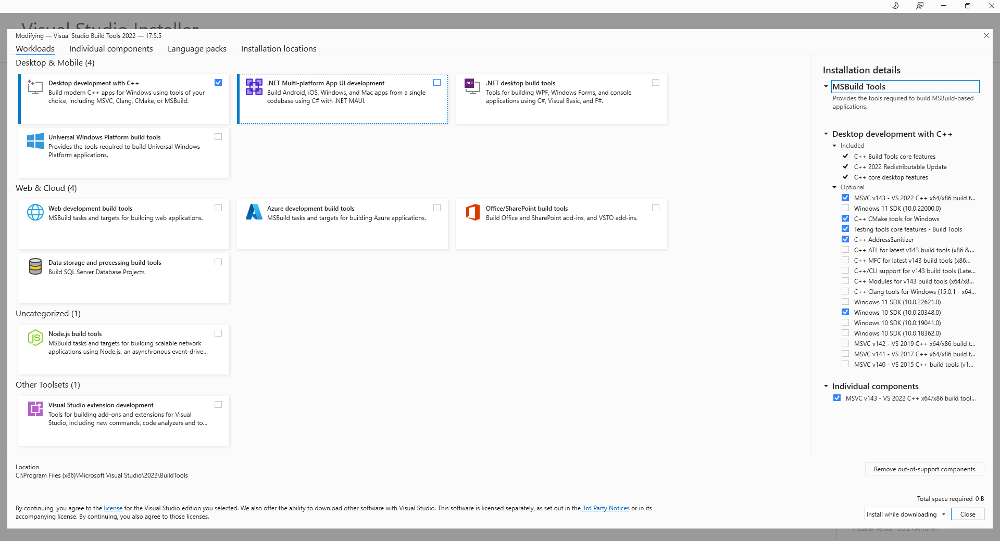

# Autoscription

to run multi_rapid_test_pagos_lenovo use the following command

```
python multi_rapid_test_pagos_lenovo <username> <password>
```

docs:
selenium page factory

https://www.browserstack.com/guide/page-object-model-in-selenium-python

## Package to exe

**DEPRECATED**

```commandline
pyinstaller .\autoscription_main.spec --noconfirm
```
more information on `pyinstaller` can be found [here](https://pyinstaller.org/en/stable/index.html)

or
```commandline
 python .\package_application.py
```

you can find the `autoscription_main.exe` in the newly created `dist` directory. To upload it to production zip the `dist/autoscription_main` directory and name it `autoscription_main_v{major_version}.{minor_version}.{bugfixes}.zip`

If you want to test the application, create the following path  `C:\ScanSnap\raw_scans\last_scan` and insert the scans of the day you want to run. Also add `{path_to_project}\autoscription\dist\autoscription_main\executions\{year}{month}{day}`
with optional `idika`, `results`, `scans` inside.


setup test vm
install vagrant in your computer
```commandline
winget install --id=Hashicorp.Vagrant  -e
```
restart your shell

run the following to setup/startup your testing machine
```commandline
vagrant up
```
Please note that the setup takes more tha 15m. Startup take 1m

```commandline
Powershell

 Start-Process -FilePath .\dist\autoscription_main.exe -Wait -RedirectStandardOutput output.txt
```

`py2exe` is not preferred because its incompatible with ttkthemes package

Pyinstaller vs cx_freeze
https://coderslegacy.com/cx_freeze-vs-pyinstaller-comparison/

Pyinstaller windows gotchas
https://pyinstaller.org/en/stable/usage.html#windows


GUI Tinker

https://docs.python.org/3.8/library/tkinter.html

TTinker themes

https://ttkthemes.readthedocs.io/en/latest/index.html

tkcalendar pyinstaller issue
https://tkcalendar.readthedocs.io/en/stable/howtos.html

## Running the application locally

For the application to run locally using
```commandline
python autoscription_main.pyw
```
You need to install 
install https://github.com/tschoonj/GTK-for-Windows-Runtime-Environment-Installer/releases
as it is a weasyprint dependency

Pre-commit hooks
https://pre-commit.com/
https://towardsdatascience.com/how-to-add-git-hooks-for-your-python-projects-using-the-pre-commit-framework-773acc3b28a7

to enable pre-commit hook run the following
```commandline
pre-commit install --hook-type pre-commit 
```

Formatting
https://black.readthedocs.io/en/stable/integrations/editors.html

Requirements for packaging application<br>
Download visual studio build tools from [here](https://visualstudio.microsoft.com/downloads/?q=build+tools+for+visual+studio#build-tools-for-visual-studio-2022)<br>
Install the following



# Run tests locally
```commandline
tox -e runtest
```

Pip version should be 24.0
```commandline
pip install pip==24.0
```


# Platform Design
[platform-design.md](docs%2Fplatform-design.md)