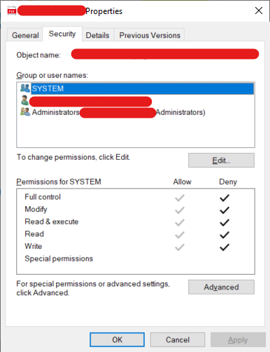

# Extract Metadata Testing

### PdfReadError
To introduce a parsing error on the PdfReader under extract_metadata you will need
to replace an under executions/data/idika/number/*.pdf with an empty txt file that ends in .pdf

### PermissionError
To introduce a PermissionError on the PdfReader under extract_metadata you will need
to remove all permissions from this file like in the photo below

